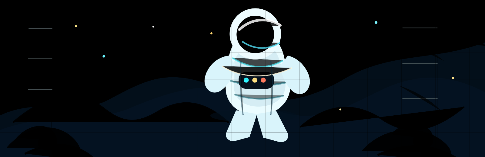

  <h1>Arthur Reimus</h1>
  <h3>AI Architect @ IBM | Incoming Solutions Architect @ BytePlus</h3>
  

I build production enterprise AI systems: agent workflows, RAG, evals, secure cloud runtimes, and tools people actually use.

My focus is the last mile of enterprise AI: turning models into secure, grounded, evaluated, cost-aware systems that fit real workflows.

---

## Current Focus

- Architecting secure agentic AI platforms with access controls, reusable templates, evaluation loops, and operational guardrails.
- Building AI developer workflow tools for code review, SDLC automation, document processing, multimodal translation, and content generation.
- Preparing for a field-facing AI and platform solution architecture role at BytePlus in July 2026.
- Writing about context engineering, AI agents, RAG, evals, and practical LLM systems at [Ylang Labs](https://ylanglabs.com).

---

## Selected Work

| Area | What I work on |
| --- | --- |
| Agentic AI platforms | Secure runtime patterns, agent templates, governance controls, and production-readiness workflows. |
| AI code review | Autonomous agents that review GitHub pull requests, enforce engineering standards, and keep humans in the review loop. |
| Multi-agent orchestration | Canvas-based workflows for coordinating assistants and agents across repeatable business processes. |
| Document AI and RAG | Grounded retrieval, structured extraction, quality checks, and workflow integration for high-volume document use cases. |
| Developer workflow automation | IDE-integrated assistants for planning, requirements, tests, implementation support, and standards enforcement. |
| Multimodal productivity | Translation and content-generation tools for document, text, voice, image, and presentation workflows. |
| Computer vision research | Published an award-winning thesis on tongue-print biometric recognition using ORB and Raspberry Pi hardware. |

---

## Tech Stack

### AI Agents, RAG, And Evals

### Languages And App Frameworks

### Cloud, Data, And Delivery

---

## Writing And Research

- I write practical AI engineering notes at [Ylang Labs](https://ylanglabs.com), especially around context engineering, production agents, RAG, MCP, evals, and reliable LLM workflows.
- My published undergraduate research is [Recognition of Tongue Print Biometric using Oriented FAST and Rotated BRIEF (ORB)](https://doi.org/10.1109/ICoDSA55874.2022.9862830), presented at ICoDSA 2022.

---

## Recognition

- 7x AWS Certified, including Generative AI Developer - Professional, Machine Learning - Specialty, Machine Learning Engineer - Associate, Data Engineer - Associate, Solutions Architect - Associate, AI Practitioner, and Cloud Practitioner.
- AWS Community Builder 2026 - AI Engineering.
- IBM Generative and Agentic AI Expert - Architect.
- IBM Tech Awardee 2026.
- 2x IBM global hackathon winner.

---

## Connect

---

GitHub activity

  

